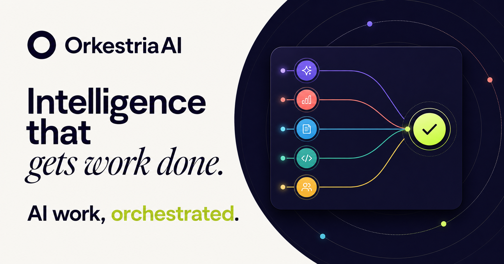
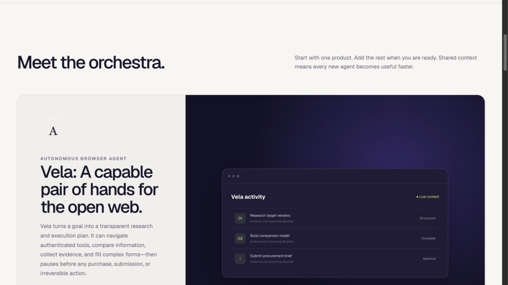
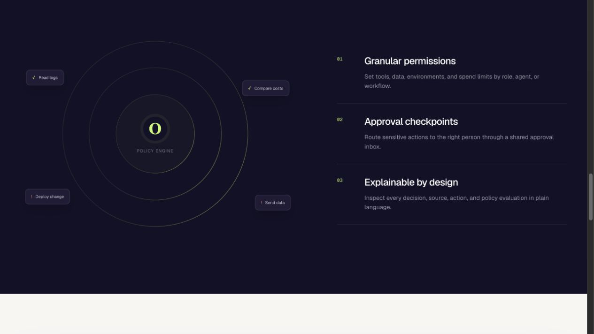
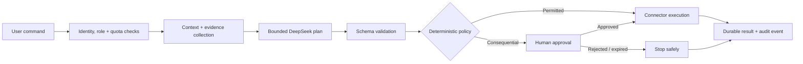
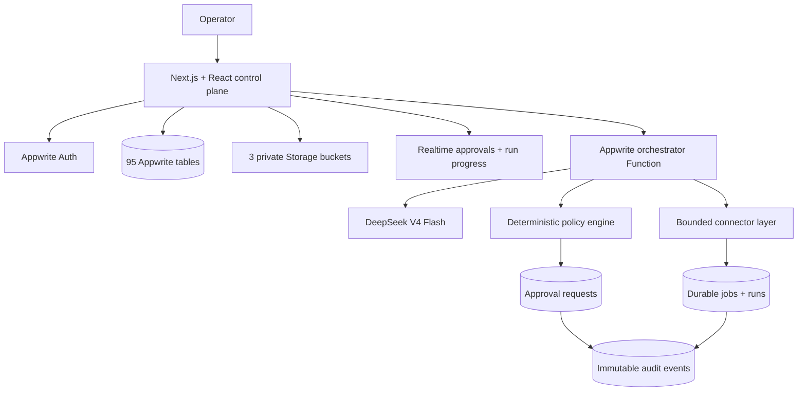

# OrkestriaAI

> **AI work, orchestrated.** A governed operations control plane where specialized agents can browse, automate, operate, optimize, and review—without bypassing human authority.

<p align="center">
  <a href="https://orkestriaai.appwrite.network/">
    
  </a>
</p>

<p align="center">
  <a href="https://orkestriaai.appwrite.network/"><strong>Live product</strong></a>
  ·
  <a href="#governed-execution"><strong>Governed execution</strong></a>
  ·
  <a href="#system-architecture"><strong>Architecture</strong></a>
  ·
  <a href="#quick-start"><strong>Run locally</strong></a>
</p>

<p align="center">
  
  
  
  
  
  
</p>

## OrkestriaAI in 30 seconds

Most agent platforms focus on what a model *can* do. OrkestriaAI focuses equally on what it is **allowed** to do, who must approve it, what evidence supports it, and how the decision is audited afterward.

- **Specialists over a generic agent** — each product has a bounded operational domain and purpose-built workspace.
- **Plans before actions** — DeepSeek produces structured, validated plans; deterministic policy decides whether a step may continue.
- **Human authority is structural** — money movement, outbound data, infrastructure changes, publishing, and other consequential actions stop at approval checkpoints.
- **Every run is inspectable** — context, sources, steps, policy results, costs, artifacts, approvals, and outcomes become durable records.

## Product suite

<p align="center">
  
</p>

| Product | Operational responsibility | Human-control boundary |
|---|---|---|
| **Vela** | Browser research and web-based work | Pauses before purchases, submissions, or irreversible actions |
| **Loom** | Observable workflows assembled from natural language | Keeps decisions, transformations, apps, and approvals editable |
| **Tempo** | Deployment, incident, log, and infrastructure analysis | Routes production changes and rollback execution through policy |
| **Helio** | Cloud-cost attribution, anomalies, rightsizing, and forecasts | Requires evidence, ownership context, risk, and approval before change |
| **Aegis** | Code, dependency, IaC, and cloud-configuration review | Produces prioritized findings and fix guidance without silently mutating systems |

All five products share workspace identity, context, permissions, files, run history, approvals, notifications, and audit events.

## Governed execution

<p align="center">
  
</p>



The model cannot grant itself permission, change an approval rule, approve its own work, or convert incomplete evidence into production assurance. Policy remains authoritative even when the model recommends a different action.

### Execution lifecycle

```text
authenticate → authorize workspace → validate request → create idempotent run
      → collect evidence → generate bounded plan → evaluate deterministic policy
      → pause for approval when required → execute permitted step → audit outcome
```

Background jobs persist their state, attempts, idempotency keys, availability, leases, errors, costs, and artifacts so interrupted work can recover without duplicating consequential actions.

## System architecture



The platform foundation is declared in [`appwrite/schema.mjs`](./appwrite/schema.mjs): **95 explicitly indexed TablesDB tables**, **three private Storage buckets**, and the `orchestrator` Function. Browser code uses user-scoped access; privileged model and connector work stays server-side.

## What this repository demonstrates

| Concern | Implementation evidence |
|---|---|
| Agent orchestration | Bounded plans, specialized studios, shared runs, jobs, files, artifacts, and connector manifests |
| Deterministic governance | Risk classification, approval rules, policy packs, separation of recommendation from authorization, and auditable decisions |
| Durable execution | Idempotency keys, leases, retry limits, recovery state, cost records, and completion or failure evidence |
| Enterprise controls | Identity-aware workspaces, roles, teams, delegated authority, retention, regional boundaries, and private storage |
| AI quality | Model registry, evaluation suites, prompt versions, release candidates, evidence gates, and human promotion decisions |
| Operational readiness | Provider handshakes, connector certification, runbooks, resilience evidence, launch gates, and reversible human decisions |
| Product breadth | Browser work, workflow automation, DevOps, cloud cost, security, ecosystem, scale, trust, and executive control rooms |
| Verification | Rendered-HTML contracts, Appwrite foundation tests, build checks, provider checks, and phase-specific smoke suites |

## Trust boundaries

- Model output is treated as a proposal, never as authorization.
- High-risk actions require the configured human approval path.
- An agent cannot execute and approve the same consequential work.
- Workspace mutations are authorized and audited in Appwrite.
- Private evidence stays in permission-controlled tables and Storage buckets.
- Untrusted instructions are evaluated as data and cannot override policy.
- Rehearsal evidence is explicitly labeled and cannot masquerade as production capacity, security assurance, or connector certification.
- A valid launch decision records intent only; it does not publish the site, invite customers, activate billing, or mutate an external system.

## Repository map

| Path | Responsibility |
|---|---|
| [`app/`](./app) | Marketing pages, protected product studios, command centers, and API routes |
| [`app/vela/`](./app/vela) | Governed browser-agent workspace |
| [`app/loom/`](./app/loom) | Observable workflow studio |
| [`app/tempo/`](./app/tempo) | DevOps investigation and safe-action workspace |
| [`app/helio/`](./app/helio) | Evidence-backed cloud-cost intelligence |
| [`app/aegis/`](./app/aegis) | Security-review workspace |
| [`app/trust/`](./app/trust) | Policy, assurance, and trust controls |
| [`app/overture/`](./app/overture) | General-availability evidence and final human decision control room |
| [`functions/orchestrator/`](./functions/orchestrator) | Model access, planning, policy evaluation, orchestration, and durable actions |
| [`appwrite/schema.mjs`](./appwrite/schema.mjs) | TablesDB, Storage, indexes, and Function foundation |
| [`scripts/appwrite/`](./scripts/appwrite) | Provisioning, deployment, and phase-specific smoke verification |
| [`tests/`](./tests) | Rendered application and Appwrite-foundation contracts |

## Release evidence

The repository contains the implementation for all 18 planned product phases, ending with **Overture**, the General Availability Command control room. That does not mean every external production claim is automatically satisfied.

| Area | Repository status |
|---|---|
| Product and control-plane implementation | Implemented across the planned phases |
| Deterministic preflight | Creates bounded fixtures without production traffic |
| Load and penetration assurance | Requires independent real-world evidence |
| Connector certification | Candidates remain uncertified until verified externally |
| Runbooks | Remain unreviewed and unexercised until human operators complete them |
| Customer onboarding | Fixture-only until real onboarding evidence exists |
| Final GA decision | Human-controlled and blocked while required evidence is incomplete |

This distinction is intentional: the product records what is known, what is simulated, what is externally verified, and what remains blocked.

## Quick start

### Requirements

- Node.js 22.13 or newer
- npm
- An Appwrite project for authenticated, durable workflows
- A DeepSeek API key for model-backed planning

```bash
git clone https://github.com/captain-jack-sparrow909/OrkestriaAI.git
cd OrkestriaAI

cp .env.example .env.local
npm install
npm run dev
```

The public product experience can be explored without provisioning the complete Appwrite foundation. Protected workspaces and durable operations require the configured platform services.

### Provision Appwrite

After adding the Appwrite endpoint, project ID, and a scoped server API key:

```bash
npm run appwrite:provision
npm run appwrite:deploy-function
```

The provisioning script applies the declared tables, indexes, buckets, and Function configuration from the repository.

## Verification

```bash
npm run lint
npx tsc --noEmit
npm run build
npm test
```

Additional platform checks are available for configured environments:

```bash
npm run appwrite:check
npm run deepseek:check
npm run appwrite:smoke-phase18
```

The phase smoke suites are evidence-oriented. They verify durable records, policy decisions, blockers, and bounded fixture behavior without claiming that fixture execution proves production capacity.

## Deployment

OrkestriaAI uses **vinext** to produce Appwrite Sites-compatible output. Deployment remains separate from the recorded launch decision:

```bash
npm run appwrite:deploy-site
```

Run deployment only after the intended Appwrite project, origin, Function, environment values, and access mode have been reviewed.

## Documentation

- [`docs/PRODUCT_BLUEPRINT.md`](./docs/PRODUCT_BLUEPRINT.md) — product thesis, shared platform, data model, approval engine, architecture, and delivery phases
- [`appwrite/schema.mjs`](./appwrite/schema.mjs) — executable platform foundation
- [`functions/orchestrator/src/policy.js`](./functions/orchestrator/src/policy.js) — deterministic approval policy
- [`functions/orchestrator/src/deepseek.js`](./functions/orchestrator/src/deepseek.js) — bounded model integration

---

<p align="center">
  <strong>OrkestriaAI</strong><br />
  Intelligence that gets work done—inside boundaries people control.
</p>
